# 	spring-boot项目的docker集成化部署

[toc]

## 前言
> 据说流行的微服务和docker一起，更配哦！接下来，使用简单spring-boot项目演示docker的集成化部署的案例，在看过微笑的博客觉得不过瘾，自己动手，下面的方案与Devops的方式比较接近；希望搭建理解这种思路。

## 基本思路与方案
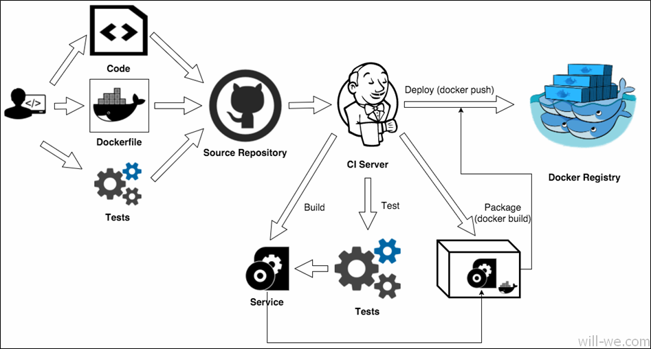
1.  开发者`push`到`git服务器`
2.  Jenkins通过`触发器`收到通知
3.  Jenkins克隆工作区
4.  Jenkins创建一个Docker镜像（注意：这是用`maven的docker插件`）
5.  Jenkins将镜像推到Docker Hub
> 借鉴图片

> 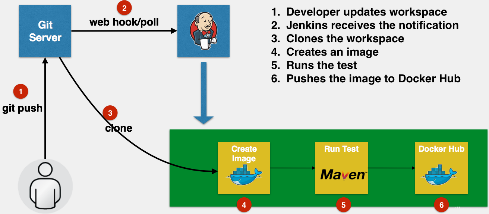

## 基本步骤

### 准备源码

Github路径：[spring-boot_docker_demo](https://gitee.com/will-we/spring-boot_docker_demo)
> 说明：这里使用com.spotify的docker-maven-plugin的插件；用法参阅代码注释。

### 服务器和基础环境

#### Linux下Java8安装
##### 1. 下载

    wget --no-cookies \
    --no-check-certificate \
    --header "Cookie: oraclelicense=accept-securebackup-cookie" \
    http://download.oracle.com/otn-pub/java/jdk/8u181-b13/96a7b8442fe848ef90c96a2fad6ed6d1/jdk-8u181-linux-x64.tar.gz \
    -O jdk-8-linux-x64.tar.gz

##### 2. 解压安装
    tar -zxvf jdk-8-linux-x64.tar.gz
    mv jdk-8-linux-x64.tar.gz /usr/local

##### 3. 配置环境变量
    export JAVA_HOME=/usr/local/jdk1.8.0_181/
    export PATH=$PATH:$JAVA_HOME
    export JAVA_HOME=/usr/local/jdk1.8.0_181/
    export JRE_HOME=$JAVA_HOME/jre                 #tomcat需要
    export CLASSPATH=.:$JAVA_HOME/lib:$JRE_HOME/lib
    export PATH=$JAVA_HOME/bin:$JRE_HOME/bin:$PATH

##### 4. 刷新环境变量
    source  /etc/profile #刷新环境变量
    2.1.3.2.3	Linux下Manven安装 

#### maven的安装
##### 1. 下载maven
    wget http://mirrors.cnnic.cn/apache/maven/maven-3/3.5.0/binaries/apache-maven-3.5.0-bin.tar.gz

##### 2.  安装
    tar -zxvf apache-maven-3.5.0-bin.tar.gz
    mv apache-maven-3.5.4 /usr/local/maven/apache-maven-3.5.4

##### 3. 配置环境变量
    export MAVEN_HOME=/usr/local/maven/apache-maven-3.5.4
    export PATH=$JAVA_HOME/bin:$JRE_HOME/bin:$MAVEN_HOME/bin:$PATH #注意这里添加$MAVEN_HOME/bin

##### 4. 刷新环境变量
    source  /etc/profile #刷新环境变量
#### 	安装Jenkins 
> Jenkins安装有三种方式
##### 1. 基于Docker的安装
    docker run \
      -u root \
      --rm \
      -d \
      -p 8080:8080 \
      -p 50000:50000 \
      -v jenkins-data:/var/jenkins_home \
      -v /var/run/docker.sock:/var/run/docker.sock \
      jenkinsci/blueocean
#####  2. 基于war包方式
> 在官网下载，放入Tomcat的目录中即可；打war，大家肯定十分熟悉的操作。

##### 3. 使用yum方式直接安装 （推荐）

###### 1.下载
    sudo wget -O /etc/yum.repos.d/jenkins.repo https://pkg.jenkins.io/redhat-stable/jenkins.repo 
    sudo rpm --import https://pkg.jenkins.io/redhat-stable/jenkins.io.key  

###### 2.安装
    yum install jenkins

###### 3. 配置
    vi /etc/sysconfig/jenkins

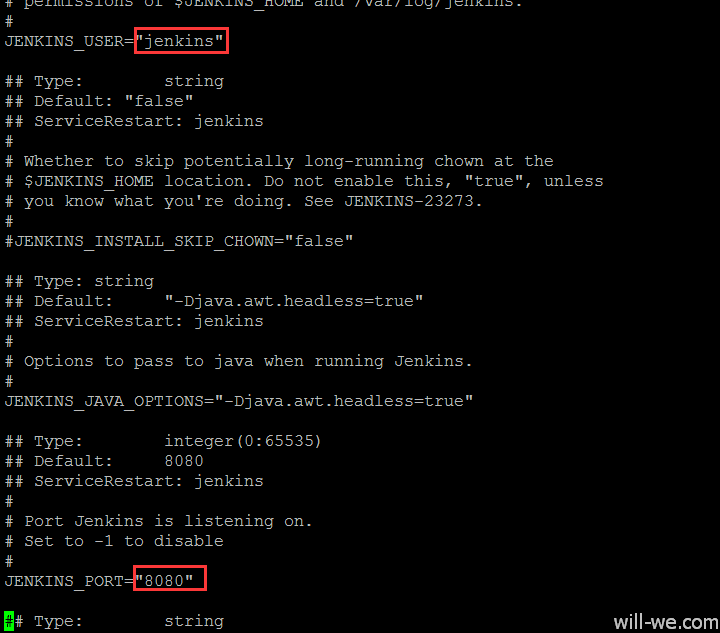
> 可避免避免和`Tomcat`端口重复的问题

###### 4. 启动服务
    service jenkins start

##### Jenkins的基本初始化
###### 1. 登录

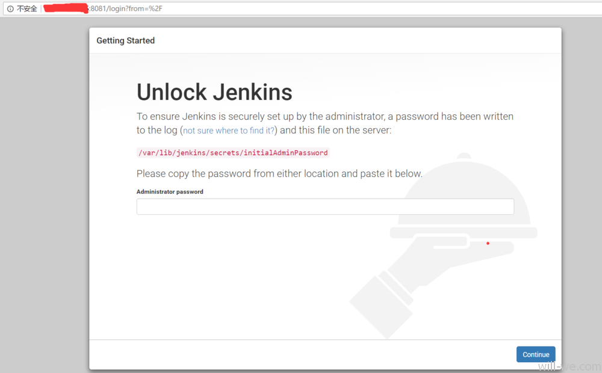

###### 2. 安装Jenkins插件
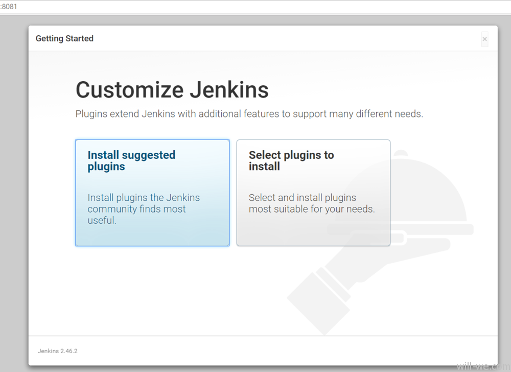

###### 3.安装成功
> 基本按照推荐来
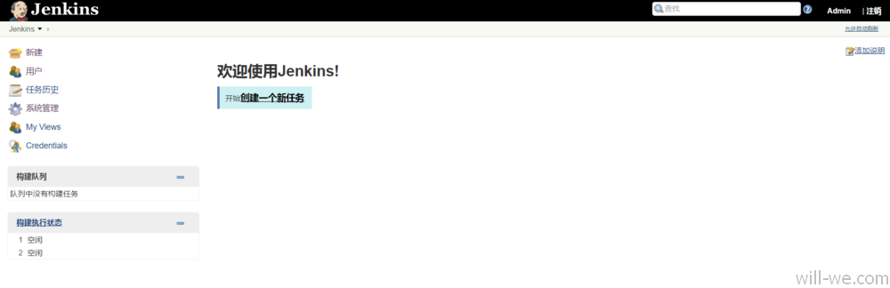

###### 4. 配置jdk和maven配置
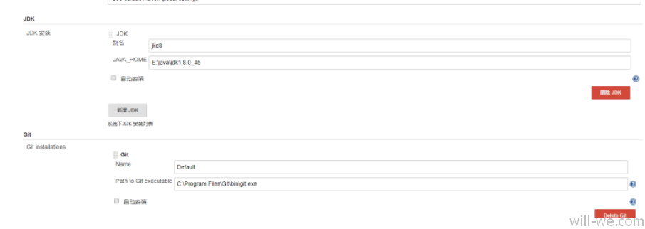
> 说明这里其实`git`非必须，之前的插件安装中安装了

##### Pipeline语法
> 语法请自行查阅资料，这里使用groovy的语法    
- [devops \[持续交付实践\] pipeline：pipeline 使用之语法详解](https://testerhome.com/topics/10033)
- [Jenkins语法](https://jenkins.io/doc/book/pipeline/)

##### Jenkins的项目配置
###### 1. 新建pipeline的项目

###### 2. 添加如下jekins的脚本内容：注意：使用pipeline的语言
 
    #!groovy
    pipeline{
    	agent any

    	environment {
    		REPOSITORY="https://gitee.com/will-we/spring-boot_docker_demo.git"
    	}
        tools {
            maven 'm3'
            jdk 'java8'
        }
    	stages {
    		stage('获取代码'){
    			steps {
    				echo "start fetch code from git:${REPOSITORY}"
    				//清空当前目录
    				deleteDir()
    				//拉去代码	
    				git "${REPOSITORY}"
    			}
    		}
    		stage('代码静态检查'){
    			steps {
    				//伪代码检查
    				echo "start code check"
    			}
    		}		
    		stage('编译+单元测试'){
    			steps {
    				echo "start compile"
    				//切换目录
    				sh 'mvn -Dmaven.test.skip=true -U clean install'
    			}
    		}
    		stage('构建镜像'){
    			steps {
    				echo "start build image"
    				//build镜像
    				sh 'mvn clean package docker:build'
    			}
    		}
    	}
    }
###### 3.  立即构建”，查看运行的日子如下：
 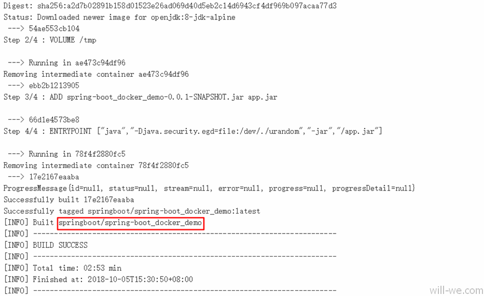
 
###### 4.  如果看上面的恭喜你，构建镜像成功；参看docker的镜像，对你“so easy”
 

###### 5. 启动docker容器
    # 最好添加--name参数
    docker run --name= springboot/spring-boot_docker_demo -p 8081:8080 -t srping-demo

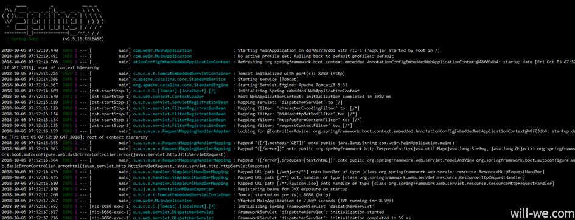
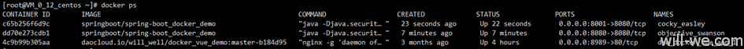

#### 问题解决
##### 1. Jenkins构建时出现：“mvn: command not found”
 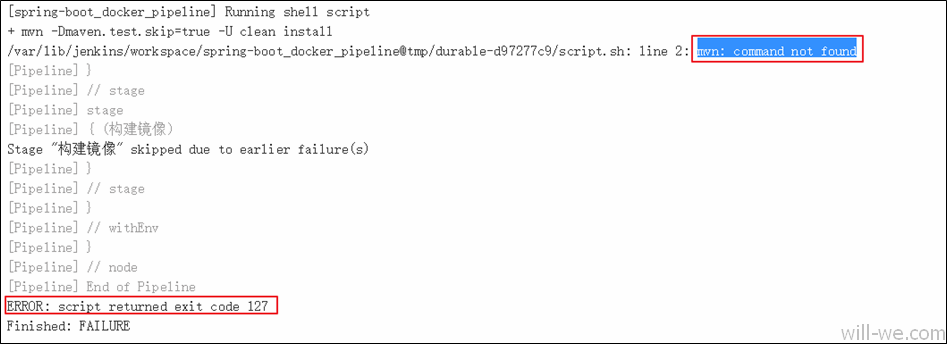
解决方案：
> 自己试着摸着石头过河，只能借助搜索引擎了；如下是解决的流程：

1）	安装Pipeline Maven Integration插件
 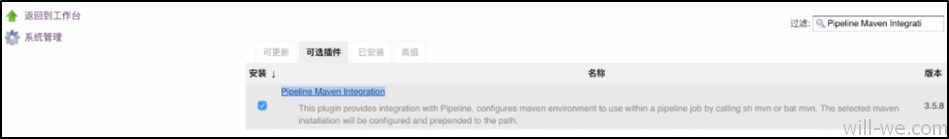
2）	检查环境变量
> 上面安装了插件后依旧不好使，继续找原因吧，Maven not found in Jenkins【StackOverflow】有着这个题问题：原因如下：    
The reason is that Jenkins is installed and run as a ‚system user‘ service. This means the process can‘t see the ENV variables and PATH of your user (user level). Setting up maven in PATH and ENV variables on system level makes the trick.    
大体意思是：jekins的无法读取系统的环境变量；于是分别查看了大致的服务器和jekins的变量。 
Jenkins	服务器/bin/bash

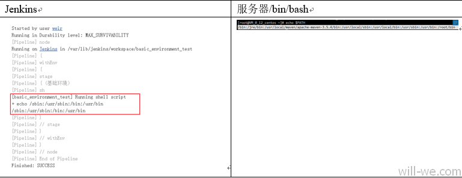

3）	Jenkins导入java和maven的权限

> 还记得之前配置Jdk和maven的“全局工具设置”，注意：这里设置也是依旧不能直接读取，需要如下方式引入；“m3”是配置时名称，“java8”也是配置名称。

        tools {
            maven 'm3'
            jdk 'java8'
        }
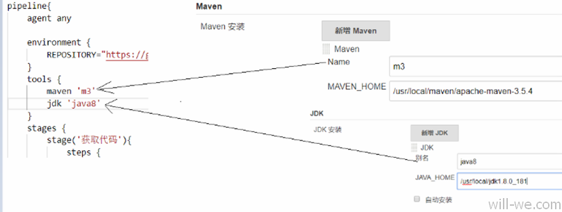

##### 2. Linux中端口占用问题
    #方式一：参看端口8080信息
    netstat -lnp | grep 8080
    #方式二：参看端口8080信息
    lsof -i :808
    #杀死进程
    kill -9 pid号

## 结语    
### 1. 本文总结：
> 我们使用了一个简单的`spring-boot`项目部署到远程服务器的操作流程，从而实现了推送代码到Git远程仓库，使用jekins的集成化构建docker实现，自动化部署方式。

### 2. 后期优化：
> 演示spring-boot的简单部署方式，其实该项目的还有很多地方优化，例如：`doker push`docker的仓库、使用`Jenkins`的触发器`git hook`等；以及后期；spring-boot的多模块、以及`docker compose`的使用等。由于篇幅的原因可能放在了后面的文章。

---
参考资料
- [SpringBoot+Docker+Git+Jenkins实现简易的持续集成和持续部署](http://niocoder.com/2018/04/22/SpringBoot+Docker+Git+Jenkins%E5%AE%9E%E7%8E%B0%E7%AE%80%E6%98%93%E7%9A%84%E6%8C%81%E7%BB%AD%E9%9B%86%E6%88%90%E5%92%8C%E9%83%A8%E7%BD%B2/)
- [Spring Boot 2.0(四)：使用 Docker 部署 Spring Boot](http://blog.51cto.com/ityouknow/2088355)[Maven 插件之 docker-maven-plugin 的使用](https://blog.csdn.net/aixiaoyang168/article/details/77453974)
- [部署流水线搭建小记：Docker、Jenkins、Java和Couchbase](http://dockone.io/article/1735)

**================================================================================**
  
- 个人博客：[will-we.com](will-we.com)
- 我的掘金：[weir](https://juejin.im/user/5a63058b518825732646e4ed)
- 我的简书：[weir](https://www.jianshu.com/u/26b9661e9e78)
  
**================================================================================**
